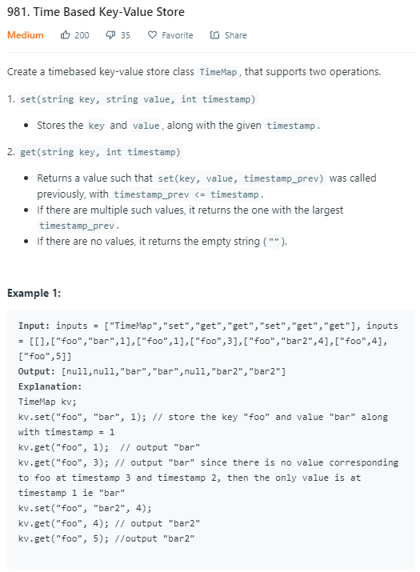

### Question



### My solution
Level order traversal with a small modification.
```python
class Node:
    def __init__(self, val):
        self.val = val
        
        
def binarySearch(ls, time):
    # this function searches for the node with largest possible timestamp that is <= time 
    if len(ls) == 0:
        return None
    
    elif len(ls) == 1:
        return ls[0] if ls[0].val[1] <= time else None
    
    elif ls[0].val[1] > time:
        return None
    
    else:
        return binarySearch_util(ls, time, 0, len(ls) - 1)
    
    
def binarySearch_util(ls, time, start, end):
    if start == end:
        return ls[start]
    elif start + 1 == end:
        return ls[end] if ls[end].val[1] <= time else ls[start]
    
    mid = int(0.5 * (start + end))
    mid_time = ls[mid].val[1]
    
    if mid_time == time:
        return ls[mid]
    elif mid_time > time:
        return binarySearch_util(ls, time, start, mid)
    else:
        return binarySearch_util(ls, time, mid, end)

    
class TimeMap:
    def __init__(self):
        """
        Initialize your data structure here.
        """
        # map from key to a list of nodes
        self.key2list_map = {}
        

    def set(self, key: str, value: str, timestamp: int) -> None:
        node = Node((value, timestamp))
        
        if key not in self.key2list_map:
            self.key2list_map[key] = []
            
        self.key2list_map[key].append(node)

    def get(self, key: str, timestamp: int) -> str:
        if key not in self.key2list_map:
            return ""
        
        else:
            node = binarySearch(self.key2list_map[key], timestamp)
            return "" if node is None else node.val[0]


# Your TimeMap object will be instantiated and called as such:
# obj = TimeMap()
# obj.set(key,value,timestamp)
# param_2 = obj.get(key,timestamp)
```