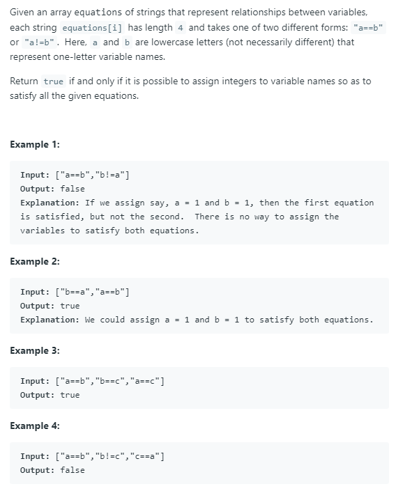

### Question



### My solution
Union find by rank.
```python
class DisjointSet(object):
    def __init__(self):
        self.parent = {}
        self.rank = {}
    
    def find(self, item):
        if item not in self.parent:
            return None
        
        else:
            while item != self.parent[item]:
                self.parent[item] = self.parent[self.parent[item]]
                item = self.parent[item]
            return item
        
    def union(self, item1, item2):
        if (item1 not in self.parent) or (item2 not in self.parent):
            return
        
        root1, root2 = self.find(item1), self.find(item2)
        
        if root1 == root2:
            return
        
        if self.rank[root1] < self.rank[root2]:
            self.parent[root1] = root2
            
        elif self.rank[root1] > self.rank[root1]:
            self.parent[root2] = root1
            
        else:
            self.parent[root1] = root2
            self.rank[root2] += 1
    
    def makeset(self, item):
        if item not in self.parent:
            self.parent[item] = item
            self.rank[item] = 1
    
    def connected(self, item1, item2):
        if (item1 in self.parent) and (item2 in self.parent):
            return self.find(item1) == self.find(item2)
        else:
            return False

class Solution(object):
    def equationsPossible(self, equations):
        """
        :type equations: List[str]
        :rtype: bool
        """
        disjointSet = DisjointSet()
        for eqn in equations:
            if "!" not in eqn:
                disjointSet.makeset(eqn[0])
                disjointSet.makeset(eqn[-1])
                disjointSet.union(eqn[0], eqn[-1])

        for eqn in equations:
            if "!" in eqn and eqn[0] == eqn[-1]:
                return False
            if "!" in eqn and disjointSet.connected(eqn[0], eqn[-1]):
                return False
            
        return True
```